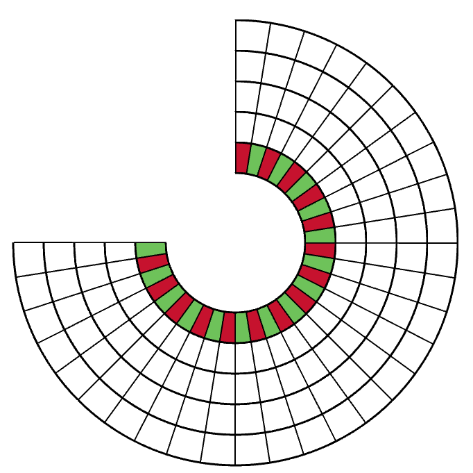

# Visualizador de Hábitos en 3D

## Descripción
Este proyecto es un visualizador de hábitos en 3D implementado con Three.js. Permite a los usuarios ver su progreso en un hábito a través de una representación visual en forma de trapezoides en una circunferencia que representa los días del mes, con una distinción clara entre días impares.

## Instalación
Para ejecutar este proyecto localmente, sigue estos pasos:

1. Clona el repositorio a tu máquina local:

git clone https://example.com/your-repo.git

2. Instala las dependencias necesarias:

3. Ejecuta el servidor de desarrollo:

El proyecto estará disponible en `http://localhost:3000/`.

## Uso
Abre el proyecto en tu navegador para ver el visualizador. Los trapezoides rojos representan los días impares del mes. Puedes modificar los colores y la disposición de los elementos modificando el código fuente.

## Imágenes

## Contribuciones
Las contribuciones son bienvenidas. Por favor, envía un pull request o abre un issue si deseas contribuir con mejoras al proyecto.

## Licencia
Este proyecto se distribuye bajo la licencia MIT. Consulta el archivo `LICENSE` para obtener más información.
